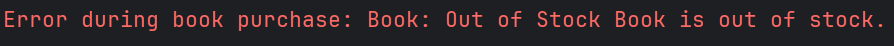

# Online Bookstore

A Spring Boot application that implements a modern online bookstore system with support for both physical and electronic books.

## Features

- Book management (add, update, delete)
- Different book types (Paper books and E-books)
- Purchase processing with strategy pattern
- User management
- Author management
- Stock tracking
- Transaction handling

## Technologies

- Java 24
- Spring Boot
- Spring Data JPA
- Maven
- MySQL Database
- Lombok

## Architecture

The application follows clean architecture principles with:

- Entity layer for domain models
- Repository layer for data access
- Service layer for business logic
- DTOs for data transfer
- Strategy pattern for purchase processing

## Structure
```
fawry_task_bookstore/
├── .gitattributes
├── .gitignore
├── pom.xml
└── src/
    ├── main/
    │   ├── java/
    │   │   └── com/
    │   │       └── fawry/
    │   │           └── bookstore/
    │   │               ├── entity/
    │   │               │   ├── Author.java
    │   │               │   ├── Book.java
    │   │               │   ├── BookType.java
    │   │               │   ├── Purchase.java
    │   │               │   ├── Role.java
    │   │               │   └── User.java
    │   │               ├── exception/
    │   │               │   ├── BookNotFoundException.java
    │   │               │   ├── InsufficientQuantityException.java
    │   │               │   ├── OutOfStockException.java
    │   │               │   ├── UnsupportedBookType.java
    │   │               │   └── UserNotFoundException.java
    │   │               ├── FawryTaskBookstoreApplication.java
    │   │               ├── repository/
    │   │               │   ├── AuthorRepository.java
    │   │               │   ├── BookRepository.java
    │   │               │   ├── PurchaseRepository.java
    │   │               │   └── UserRepository.java
    │   │               ├── request/
    │   │               │   ├── AddBookRequest.java
    │   │               │   ├── AddUserRequest.java
    │   │               │   └── BuyBookRequest.java
    │   │               ├── service/
    │   │               │   ├── AuthorService.java
    │   │               │   ├── BookService.java
    │   │               │   ├── EmailService.java
    │   │               │   ├── PurchaseService.java
    │   │               │   ├── purchasestrategy/
    │   │               │   │   ├── BookPurchaseStrategy.java
    │   │               │   │   ├── BookPurchaseStrategyFactory.java
    │   │               │   │   └── strategyimpl/
    │   │               │   │       ├── EBookPurchaseStrategy.java
    │   │               │   │       └── PaperBookPurchaseStrategy.java
    │   │               │   ├── ShippingService.java
    │   │               │   └── UserService.java
    │   │               └── TestOperations.java
    │   └── resources/
    │       └── application.properties
    └── test/
        └── java/
            └── com/
                └── fawry/
                    └── bookstore/
                        └── FawryTaskBookstoreApplicationTests.java

```

## Database Schema
The database schema includes tables for books, authors, users, and transactions. The relationships are as follows:


## Getting Started

1. Clone the repository:
```bash
git clone https://github.com/ZiadMohamed9/fawry_task_bookstore.git
```
2. Navigate to the project directory:
```bash
cd fawry_task_bookstore
```
3. Build the project using Maven:
```bash
mvn clean install
```
4. Configure the database connection in `src/main/resources/application.properties`:
```properties
spring.datasource.url=jdbc:mysql://localhost:3306/bookstore
spring.datasource.username=root
spring.datasource.password=your_password
spring.jpa.hibernate.ddl-auto=update
```
5. Run the application:
```bash
mvn spring-boot:run
```

## Testing
You can run the `TestOperations` class to test the application functionality. It includes tests for adding books, processing purchases, and managing authors.

Here are some test cases results:

1. Adding books of different types:


2. Buying an E-book:


3. Buying a Paper book out of stock:


4. Adding a book that already exists:


And more tests can be found in the `TestOperations` class.